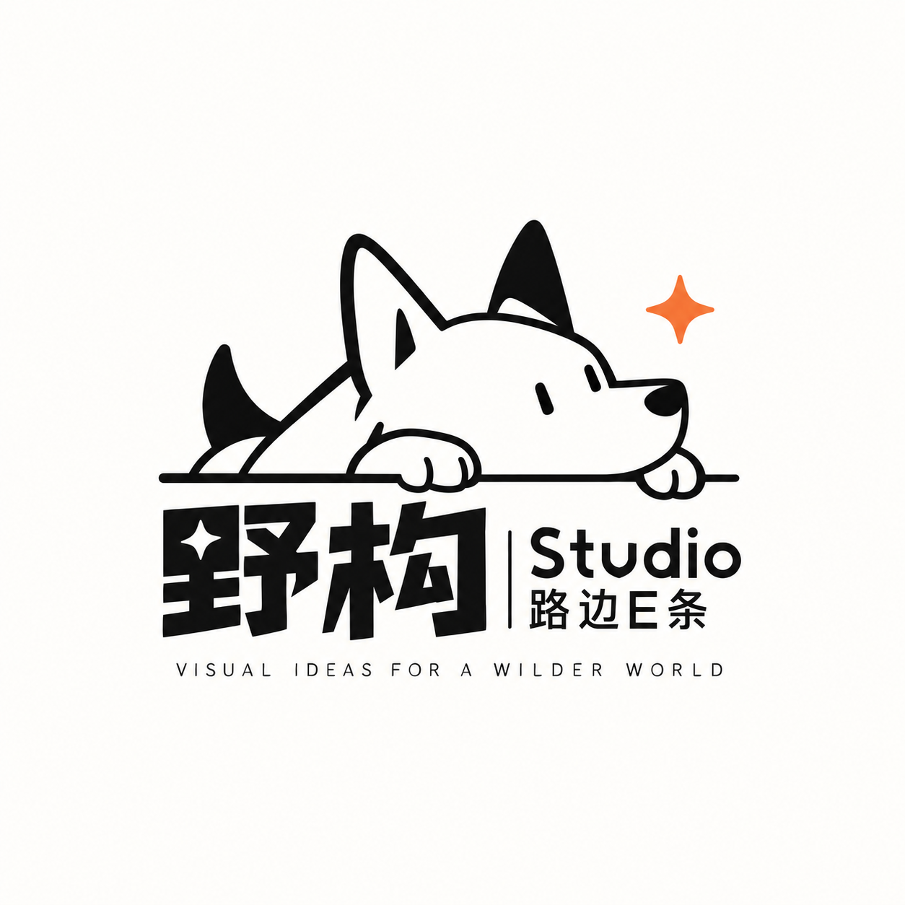

# 野构 Studio · 视频导演拉片分析工作台

<p align="center">
  
</p>

<p align="center"><strong>视频导演拉片分析工作台</strong><br>把视频拆成画面、声音和时间线，方便回看、复盘与继续创作。</p>

## 项目简介

这是野构 Studio 用来做视频导演拉片的工作台。上传视频后，系统会分别分析画面和声音，再把它们合成一条完整时间线，最后输出一套方便回看、复盘和继续创作的资料。WebUI 支持视频上传、区间截取、任务进度和 GPU 状态查看。

## 核心能力

- 每秒提取一张高清视频帧，并结合连续时间上下文分析镜头。
- 用 ASR 和 ForcedAligner 把语音整理成带时间戳的文本。
- 将画面变化、语音内容和时间码合并成一条可回看的分析时间线。
- 同时保留 Markdown、JSONL、SRT、VTT、逐帧图像和联系图等资料。
- 页面会显示任务进度、运行日志和 GPU 状态，任务结束后也可以释放显存。

## 分析输出

每个任务会生成四份主要文档：

| 文件 | 内容 |
| --- | --- |
| `01_纯视觉分析.md` | 只看画面的镜头时间线 |
| `02_纯ASR与时间戳.md` | 语音转写、分段文本和时间戳 |
| `03_代码综合时间线.md` | 画面与声音合并后的完整时间线 |
| `04_最终导演分析.md` | 用于继续整理和深化的导演分析稿 |

原始帧、联系图、索引文件和 ASR 中间结果也会一并保留，方便随时回看和二次处理。

## 使用方式

准备好 Docker、NVIDIA Container Toolkit 和模型文件后，执行：

```bash
cp .env.example .env
./scripts/link_models.sh
./scripts/run_model.sh
./scripts/run_webui.sh
```

启动后打开 <http://localhost:7877>。模型目录通过 `MODEL_ROOT` 配置，结构如下：

```text
${MODEL_ROOT}/MiniCPM-V-4_5-GPTQ
${MODEL_ROOT}/Qwen3-ASR-0.6B
${MODEL_ROOT}/Qwen3-ForcedAligner-0.6B
```

不需要打开 WebUI 时，也可以直接运行流水线：

```bash
python3 media_analysis_pipeline.py \
  --source /path/to/video.mp4 \
  --output /path/to/output
```

加上 `--max-duration 60` 可以只分析前 60 秒；已有产物时，可以用 `--package-only` 重新整理文档。

## 项目结构

```text
app/                         WebUI 与视觉分析模块
media_analysis_pipeline.py   分析流程总控
audio_timeline.py            ASR 与 ForcedAligner 流程
scripts/                     模型链接与服务启动脚本
deploy/                      GPU 部署配置
assets/brand/                野构 Studio 品牌素材
```

## 许可证与品牌

本项目源代码采用 [Apache License 2.0](LICENSE)。`assets/brand/` 中的野构 Studio 标识、Logo 及相关品牌素材不随 Apache-2.0 授权，具体说明见 [NOTICE](NOTICE)。
